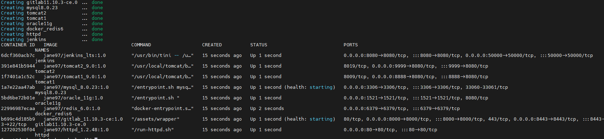
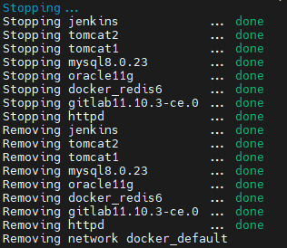

# Overview

개발에 필요한 시스템을 컨테이너화하여 쉽게 개발환경을 공유할 수 있고 동일한 환경에서 사용할 수 있다.

해당 Docker-devland 프로젝트는 단순하게 웹서버, WAS, CI, CD 하는 것이 아닌

웹서버와 WAS 연동 및 세션 클러스터링 환경과 JNDI 이용하여 서버에 있는 DB정보를 읽어서 어플리케이션과 Connection하는 기능을 추가하였다.

모니터링 시스템은 JMX 모니터링을 이용하여 WAS의 상세 모니터링이 가능하다.

Redis를 이용한 Object Cache, chainedtransaction를 이용하여 Mysql, Oracle의 트랜잭션을 구현하였다.

Docker 환경에서 사용될 샘플 소스 코드는 아래 링크에서 받으면 된다.

[https://github.com/im-happy-coder/docker-devland-application](https://github.com/im-happy-coder/docker-devland-application)

## Service list

- apache + tomcat modJK Connector
- JNDI(Java Naming Directory Interface)
- JMX(Java Management Extensions)
- Session Clustering
- Object Cache
- Chanedtransaction Manager

## Specification

> CentOS 7
>
> Docker version 20.10.16
> 
> docker-compose version 1.24.0
> 
> JDK 1.8.0_201
>
> MAVEN 3.6.1
>

## Directory Structure

```shell
.
├── docker
│   ├── docker-compose-gitlab.yml
│   ├── docker-compose-httpd.yml
│   ├── docker-compose-jenkins.yml
│   ├── docker-compose-mysql.yml
│   ├── docker-compose-oracle11g.yml
│   ├── docker-compose-redis.yml
│   └── docker-compose-tomcat.yml
├── httpd
│   ├── build
│   ├── conf
│   └── conf.d
├── img
├── jenkins
│   └── build
├── README.md
└── tomcat
    ├── build1
    ├── build2
    ├── conf1
    ├── conf2
    ├── target1
    └── target2


```


## JDK, MAVEN SetUp

JDK, MAVEN PATH
```
/app/jdk1.8.0_201
/app/apache-maven-3.6.1
```

$ vi ~/.bash_profile

```shell
JAVA_HOME=/app/jdk1.8.0_201
M2_HOME=/app/apache-maven-3.6.1
PATH=$JAVA_HOME/bin:$M2_HOME/bin:$PATH:$HOME/bin

export JAVA_HOME M2_HOME PATH

```

---

## Start Docker Project

$ git clone https://github.com/im-happy-coder/docker-devland.git

## Sample Source code

$ git clone https://github.com/im-happy-coder/docker-devland-application.git

### docker-compose all up and all down

$ ./compose.sh up



$ ./compose.sh down



## MYSQL DB Settings

$ docker container exec -it mysql8.0.23 /bin/bash

$ mysql -u root -p

- 패스워드 : 없음(엔터키)

$ use mysql

- 계정 확인
    - $ select host, user, authentication_string from user;
- 외부 접속 계정 만들기 # mysql8버전부터는 grant user 불가능
    - $ CREATE USER 'wasdb'@'%' IDENTIFIED BY 'root';
    - $ GRANT ALL PRIVILEGES ON  *.* TO 'wasdb'@'%' WITH GRANT OPTION;
    - $ FLUSH PRIVILEGES;
- 다시 확인
    - $ select host, user from mysql.user;
- 생성한 계정으로 로그인
    - mysql - wasdb - root
- DB 생성
    - create database javatest
- DB 접속
    - use javatest
    
- 아래 Query 수행

```
create table board(
bid INT PRIMARY KEY AUTO_INCREMENT,
title VARCHAR(100),
content VARCHAR(1000),
 writer VARCHAR(50) NOT NULL,
passwd VARCHAR(50) NOT NULL,
writeDate VARCHAR(50) NOT NULL);

Chainedtansaction 테스트하기 위해 잃부러 DB 데이터의 null 데이터를 삽입한다.

insert into board(title, content, writer, passwd, writeDate) values('test1', '', 'kim', '1234', NOW());
```

## ORACLE DB Settings

$ docker container exec -it oracle11g /bin/bash

$ sqlplus

- 계정 생성 필요없이 기본 계정 사용
    - ID: system
    - PASSWD : oracle

- 아래 Query 수행
```
CREATE TABLE board_tb(
 useid NUMBER(10),
 uname VARCHAR(100),
 age VARCHAR(1000),
 address VARCHAR(50) NOT NULL,
 country VARCHAR(50) NOT NULL,
 writeDate VARCHAR(50),
 PRIMARY KEY(useid));


Chainedtansaction 테스트하기 위해 잃부러 DB 데이터의 null 데이터를 삽입한다.

insert into board_tb values(seq_board.nextval,'','oraclecontent1','asung','oracle1',sysdate);
```

### If you have docker and docker-compose Now use it freely

---

아래 예제 
