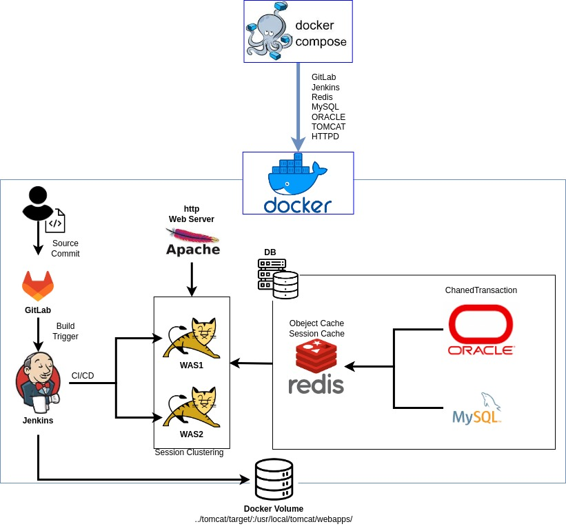

# Overview

Docker를 활용하여 개발에 필요한 시스템을 컨테이너화하고 쉽게 개발환경을 공유할 수 있고 동일한 환경에서 사용할 수 있다.

해당 Docker-devland 프로젝트는 단순하게 웹서버, WAS, CI, CD 하는 것이 아닌

웹서버와 WAS 연동 및 세션 클러스터링 환경과 JNDI 이용하여 서버에 있는 DB정보를 읽어서 어플리케이션과 Connection하는 기능을 추가하였다.

모니터링 시스템은 JMX 모니터링을 이용하여 WAS의 상세 모니터링이 가능하다.

Redis를 이용한 Object Cache, chainedtransaction를 이용하여 Mysql, Oracle의 트랜잭션을 구현하였다.

Docker 환경에서 사용될 샘플 소스 코드는 아래 링크에서 받으면 된다.

[https://github.com/im-happy-coder/docker-devland-application](https://github.com/im-happy-coder/docker-devland-application)

## Service list

- apache + tomcat modJK Connector
- JNDI(Java Naming Directory Interface)
- JMX(Java Management Extensions)
- Session Clustering
- Object Cache
- Chanedtransaction Manager

## Enviroment

> CentOS 7
>
> Docker version 20.10.16
> 
> docker-compose version 1.24.0
> 
> JDK 1.8.0_201
>
> MAVEN 3.6.1
>

## Directory Structure

```shell
.
├── compose.sh
├── docker
│   ├── docker-compose-gitlab.yml
│   ├── docker-compose-httpd.yml
│   ├── docker-compose-jenkins.yml
│   ├── docker-compose-mysql.yml
│   ├── docker-compose-oracle11g.yml
│   ├── docker-compose-redis.yml
│   └── docker-compose-tomcat.yml
├── httpd
│   ├── build
│   ├── conf
│   └── conf.d
├── img
│   ├── composeDown.PNG
│   └── composeUp.PNG
├── jenkins
│   └── build
├── mode.sh
├── README.md
└── tomcat
    ├── build1
    ├── build2
    ├── conf1
    ├── conf2
    ├── target1
    └── target2

```

---

- Notion Link: 
-- https://grateful-eye-0c3.notion.site/index-d66caf20989f4336a8e430f4b380101f?pvs=4
